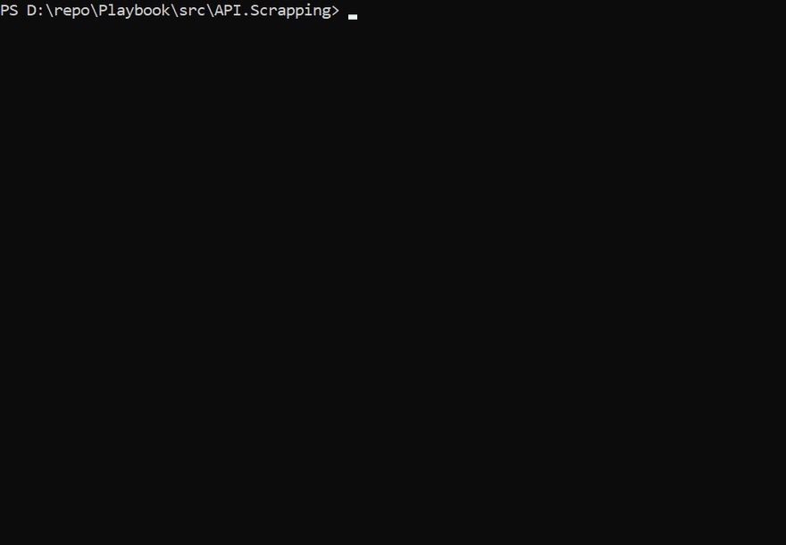
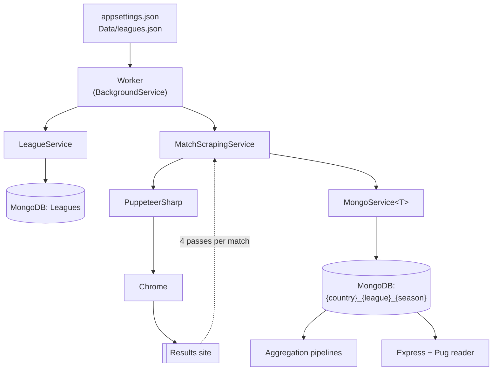

# Playbook

A .NET data pipeline that pulls semi-structured data from a source it does not
control, parses it defensively, normalises it into a typed model, writes it
idempotently to MongoDB, and aggregates the result into something you can make a
decision from.

That is the same shape as a freight EDI or TMS integration, with the nouns
changed. A partner endpoint you have no authority over. A format that changes
without notice and without a version bump. Parsing that has to degrade section by
section instead of failing the whole document. Writes that must survive being run
twice. A retry budget so a bad day upstream does not turn into a hammering. And
an aggregate at the end that is the actual product — the ingestion exists to feed
it.

Here the source happens to be a JavaScript-rendered football results site, which
is a convenient stand-in: it is public, it genuinely changes its markup between
seasons, and nobody had to sign an NDA for me to show you the code.



*A real run against the live source on 16 August 2026. The worker seeds 16
leagues from `Data/leagues.json` into an empty MongoDB, MLS and season 2026 are
typed at the prompt, Chrome is driven through the league page, and 30 matches
are found on it. The 19 fixtures that have not been played yet are rejected
from their header alone — those are the yellow lines — and the 11 finished
matches are parsed and written to `us_mls_2026`. Six minutes of real running
time, compressed to 25 seconds: the opening plays at 4x and the parse loop at
30x.*

## The problem

Match statistics are published as rendered HTML, not as an API. The pages load
their content client-side, so an HTTP request returns a shell with no data in it.
A full season sits behind a "show more" button that has to be clicked until it
disappears. Class names change between seasons. Finished, scheduled and abandoned
matches look nearly identical in the markup, and only one of the three is worth
storing.

So there is no way to ask a question like *"across a full season, how do
first-half dangerous attacks relate to first-half goals for each team?"* without
first building the dataset yourself.

## What I built

A .NET background worker that drives a real Chrome instance through
PuppeteerSharp.

- **Seeded from configuration, not hardcoded.** 16 leagues across 14 countries in
  `Data/leagues.json`, loaded into MongoDB on first run. The leagues to parse and
  the season are chosen at startup.
- **Pagination is driven, not guessed.** The worker clicks the "show more"
  control until it is gone, then collects every match link on the page.
- **Only finished matches are stored.** The status is read from the match header
  before anything else is parsed, so a scheduled or abandoned fixture costs one
  page load instead of five.
- **Each match is parsed in four passes** — header, goal incidents by half,
  statistics, lineups — across the sub-pages the site splits them over. Each pass
  captures 18 statistics per team (possession, expected goals, attacks, dangerous
  attacks, goal attempts, shots on and off target, blocked shots, passes
  attempted and completed, corners, offsides, throw-ins, free kicks, fouls,
  cards, tackles, saves), for the full match and for each half separately:
  **108 data points per match** — 18 stats × 2 teams × 3 periods.
- **Every pass fails independently.** Selectors are tried newest-first
  (`[data-testid='stat__row']`) with a fallback to the previous season's markup
  (`div.stat__row`), and each section is wrapped so that a changed class name
  costs you the lineups rather than the whole match. This is the part that
  determines whether a scraper survives to a second season.
- **Writes are idempotent.** Every match is checked for existence before insert,
  so an interrupted run is resumed by re-running it. Failures count against a
  budget of five, after which the process stops rather than hammering the source.
- **Storage is partitioned by league and season** — one collection per
  `{country}_{league}_{season}` — so a season can be re-parsed or dropped without
  touching the rest.

Then a set of MongoDB aggregation pipelines roll per-match documents up into
per-team season figures: **34 totals and averages**, and **18 derived ratios** on
top of them — dangerous attacks as a share of all attacks, shots on target per
dangerous attack, passes per attack, minutes per dangerous attack, and so on.

| Pipeline | Groups by | Stats period |
|---|---|---|
| `build/aggregation_firsthalf.js` | home team | first half |
| `build/aggregation_home.js` | home team | full match |
| `build/aggregation_guest.js` | away team | full match |

A small Express + Pug application reads the same database and renders the leagues
and matches for browsing.

## How it fits together



## Result

Runs unattended for any of the 16 configured leagues, resumable after
interruption, and produces a dataset that answers questions the source site
cannot be asked directly. The aggregation output is the actual deliverable.

## Stack

.NET 8 · PuppeteerSharp · MongoDB (driver + aggregation framework) ·
`Microsoft.Extensions.Hosting` background service with DI and structured logging ·
Node.js · Express · Pug

## Running it

Requires the .NET 8 SDK, a local Chrome, and MongoDB on `localhost:27017`.

```bash
cd src/API.Scrapping
dotnet run
```

Run it from the project directory: `appsettings.json` is read relative to the
working directory.

On first run the leagues are seeded from `Data/leagues.json`. The console asks
which leagues and which season to parse.

Configuration lives in `src/API.Scrapping/appsettings.json`:

| Setting | Meaning |
|---|---|
| `BrowserPath` / `BrowserPathMac` | Path to a Chrome executable; the platform is detected at runtime |
| `HeadlessBrowser` | Run Chrome without a window; ships `false`, so the browser is visible while it works |
| `OpenPageDelay` / `WaitForLoad` | Politeness delays, in milliseconds |
| `YearToParse` | Season, e.g. `2022-2023`; blank prompts at startup |
| `PlaybookDatabase` | MongoDB connection string and database name |

The reader UI:

```bash
cd ClientApp
npm install
npm run run-server     # http://localhost:8000
```

The match pages read one league-season collection at a time. Pick it with
`?collection=gb-eng_premier_league_2022-2023`, or set `matchesCollection` in
`ClientApp/config/index.js`; with neither set it falls back to whichever
collection the scraper populated first.

## Honest limitations

- **The tests cover the parsing, not the browser.** 24 tests pin down the row
  parser and the league model against real row shapes, with no browser involved.
  Everything that needs a page — pagination, sub-page navigation, the four passes
  — is only exercised by running it.
- **Two of the eighteen statistics no longer arrive.** Matches scraped in August
  2026 carry 16 of the 18; nothing in the statistics table maps onto `Attacks` or
  `DangerousAttacks` any more, so both land as zero. The derived ratios in
  `aggregation_firsthalf.js` divide by those averages, so that pipeline fails on
  a dataset collected now; `aggregation_home.js` and `aggregation_guest.js`,
  which stop at totals and averages, run.
- **The season chosen at startup names the collection, not the URL.** A run
  parses whatever the league's own page currently lists — recent results and
  upcoming fixtures — and stores the finished ones under
  `{country}_{league}_{season}`. Parsing a past season means pointing
  `flashscoreLink` at that season's results page.
- **The reader UI is roughly a third finished.** It lists leagues and matches and
  renders a single match. There is no styling of its own (`main.css` is empty),
  and no charting. The aggregation pipelines are run directly against MongoDB,
  not through the UI.
- **The scraper is coupled to one source's markup.** The selector fallbacks buy
  it a season or so of tolerance, not immunity. A structural redesign upstream
  needs new selectors.
- **`MongoService<T>` is a singleton with mutable per-operation state.**
  `SetCollection` reassigns the collection handle on a shared instance. That is
  safe for the current single-threaded run, and would break silently the first
  time two leagues were parsed concurrently. Returning a per-call
  `IMongoCollection<T>` handle is the fix.

## Note

Built to answer questions about publicly published match results. Delays between
requests are configurable and set conservatively by default. Check the terms of
any site before pointing it at one.
